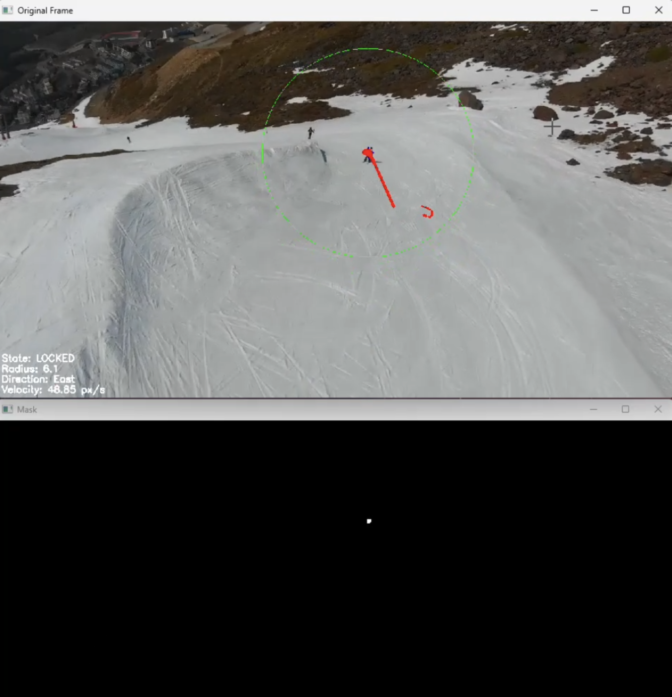
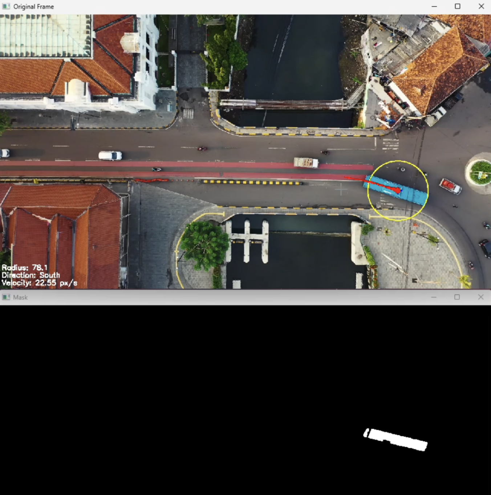

# Real-Time Object Tracker (Color-Based) - Advanced Edition

A robust, real-time computer vision application that tracks objects based on color using OpenCV. Features interactive color tuning, movement tracking, velocity estimation, **Kalman Filter smoothing**, **Area Filtering**, **Distance Restrictions**, and **Distance Estimation**.

## 📸 Demo

[
*Click the image above to watch the full demo video*

| Object Tracking | Kalman Prediction & Locking |
|-----------------|-----------------------------|
|  |  |

## 🚀 Features

-   🎯 **Auto-Calibration ("Click-to-Track")**: Automatically calculates color thresholds and size filters by selecting an object on screen.
-   🤖 **Kalman Filter**: Predicts object path during occlusions (smoothing).
-   📏 **Distance Estimation**: Estimates real-world distance from the camera (requires object width).
-   🛡️ **Smart Filtering**:
    -   **Area Filtering**: Ignores objects that are too small (noise) or too large.
    -   **Distance Restriction**: Locks onto the target and ignores similar objects far away.
-   📁 **Video Support**: Process pre-recorded video files or live webcam feed.
-   🔧 **Interactive Tuning**: Adjust HSV values and window sizes on-the-fly.
-   📝 **Data Logging**: Exports tracking data (Position, Velocity, Radius) to CSV.

## 🌍 Real-World Applications

This technology is the foundation for many industrial and commercial systems:
-   **Industrial Inspection**: Detecting specific colored parts on a conveyor belt.
-   **Sports Analysis**: Tracking players (e.g., team uniforms) or balls.
-   **Security Monitoring**: Tracking specific subjects (e.g., a person in a red shirt).
-   **Robot Vision**: Navigation based on colored markers.
-   **Manufacturing**: Automated product sorting.

## 📦 Installation

### Prerequisites
-   Python 3.9+
-   Webcam (for live tracking)

### Install Dependencies
1. **Clone the repository:**
   ```bash
   git clone https://github.com/YOUR_USERNAME/YOUR_REPO_NAME.git
   cd "Real-Time Object Tracker (Color-Based)"
   ```

2. **Create a Virtual Environment (Optional but Recommended):**
   ```bash
   # Windows
   python -m venv venv
   .\venv\Scripts\activate

   # Mac/Linux
   python3 -m venv venv
   source venv/bin/activate
   ```

3. **Install Requirements:**
   ```bash
   pip install -r requirements.txt
   ```

## 🛠️ Usage

### 1. Basic Webcam Tracking
Start the tracker with the default webcam (Make sure your venv is activated):
```bash
python main.py
```

### 2. "Click-to-Track" (Auto-Tuning)
1.  Run the app.
2.  Press **`s`** to freeze the frame.
3.  Drag a box around the object you want to track and press **`ENTER`**.
4.  The system will automatically set:
    *   HSV Color Thresholds
    *   Minimum/Maximum Area Filters

### 3. Advanced Command Line Options

**Track a Video File:**
```bash
python main.py --video path/to/video.mp4
```

**Enable Distance Restriction (Anti-Distraction):**
Prevents the tracker from jumping to similar objects further than `100` pixels away.
```bash
python main.py --video video.mp4 --max_dist 100
```

**Filter by Size (Manual):**
Ignore objects smaller than 1% or larger than 50% of the screen.
```bash
python main.py --min_area 0.01 --max_area 0.5
```

**Estimate Distance:**
If you know the object's real width (e.g., a 6.7cm tennis ball):
```bash
python main.py --width 6.7
```

### ⌨️ Controls
-   **`s`**: Select ROI to track (Click-to-Track)
-   **`p`**: Pause/Resume
-   **`q`**: Quit

## 📂 Project Structure

```
├── demo/               # Demo images
├── src/
│   ├── tracker.py      # Core tracking logic (Contour, Kalman, Distance)
│   ├── kalman.py       # Kalman Filter implementation
│   └── utils.py        # Helper functions (CSV logging, HSV calculations)
├── main.py             # Main entry point and UI loop
├── .gitignore          # Git ignore rules
└── README.md           # Documentation
```

## 📄 License
This project is open-source and available for educational and portfolio purposes.
